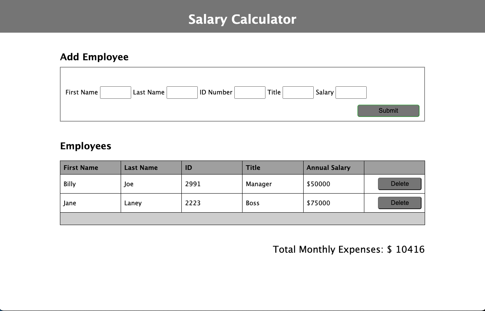
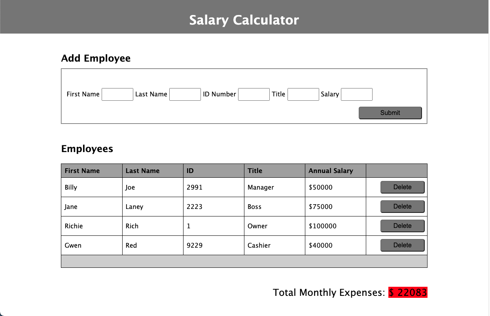

# weekend-jquery-salary-calculator

## Description

_Duration: 3 Days_

This Salary Calculator allows users to input and save employee information. Employee first name, last name, ID number, and title can be input. The calculator also accepts employee annual salary to calculate monthly expenses. The monthly expenses turns red to alert users when the amount exceeds $20,000. A delete button is available to remove an employee as well. 

## Screen Shot

## Usage

1. Input employee information into the form and click submit. The employee information will then be displayed in the employee table, below the input form. 
2. Total Monthly Expenses will be displayed under the Employees table. Monthly Expenses will turn red once expenses exceed $20,000. 
3. Click the delete button when an employee needs to be removed from the employee table. 

## Built With

HTML

CSS

jQuery

## Acknowledgement
Thanks to [Prime Digital Academy](www.primeacademy.io) who equipped and helped me to make this application a reality. 

